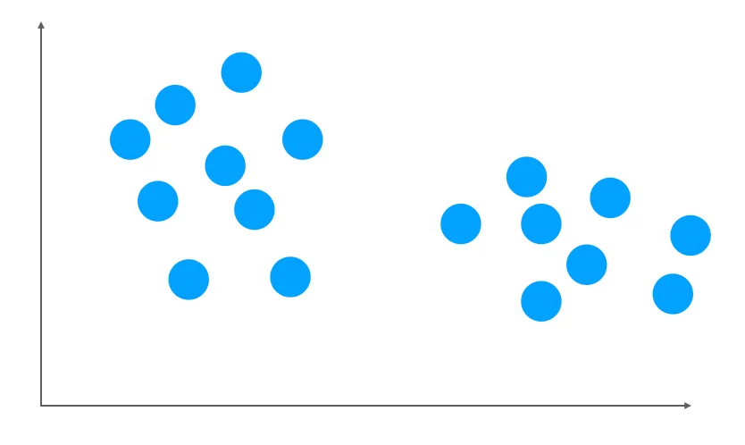
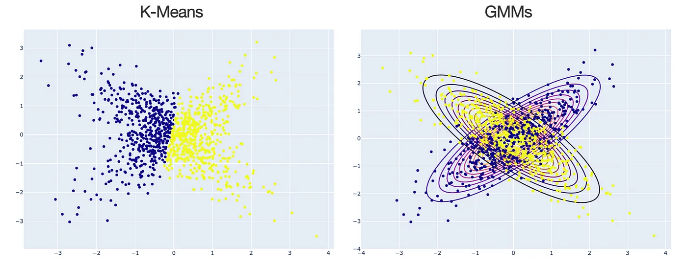

# Application 2: Gaussian Mixture Model

## Why using GMMs?

Suppose we have a dataset with 2 features. When you plot your dataset, it might look like this:

```{r, echo=FALSE, fig.align='center', out.width='100%', fig.cap='A dataset with 2 clusters, made by Maël Fabien'}

```

From the above plot, there are 2 clusters. Thus, we are aiming to solve two tasks: 

1. Clustering of the data

2. Modeling of the distribution for the data and the corresponding parameters. 

Usually, when doing clustering, people will think of [k-means](https://en.wikipedia.org/wiki/K-means_clustering). But, in fact, K-means is just a special case for Gaussian Mixture Models (GMMs) when using a specific EM algorithm. The following plot shows some differences between K-means and GMMs for clustering. In general, for k-means, the clusters are defined by the data means whereas GMM, clusters are defined by data means and variance modeled as Gaussian (aka Normal distribution).

```{r, echo=FALSE, fig.align='center', out.width='100%', fig.cap='K-Means vs. GMMs for clustering, made by Maël Fabien'}

```

Thus, when using 2 Gaussians, we want to find:

1. the mean and covariance of the first Gaussian

2. the mean and covariance of the second Gaussian

3. the weight of each Gaussian component


## Train GMM using MLE

When training a GMM, we want to identify a set of parameters that characterize our GMM. 

\[
\theta = (w_k, \mu_k, \Sigma_k), k = 1,2,3,\dots, M
\]

Similar to solve parameters in **single** Gaussian model using [MLE](https://en.wikipedia.org/wiki/Maximum_likelihood_estimation), we can take the *Score function* $\frac {dL}{d\theta}ln L(\theta)$ using log-likelihood and set it equal to 0 again, where $\prod^N_{i=1}$ is all observations, $\sum^M_{k=1}$ is all components (number of clusters), $w_k$ is component weights, and $N(x_i,\mu_k, \sigma^2_k)$ are Gussians: 

\[
\begin{aligned}
L(\theta \mid X_1,\dots, X_n) & = \prod ^N_{i=1} \sum^M_{k=1}w_k\;N(x_i,\mu_k, \sigma^2_k) \\
ln L(\theta)  = \log L(\theta \mid X_1,\dots, X_n ) &= \sum^N_{i=1} \log (\sum^M_{k=1} w_k \;N(x_i,\mu_k, \sigma^2_k)) \\
\frac {dL}{d\theta}ln L(\theta) &\stackrel{Set}{= }0
\end{aligned}
\]

Unfortunately, the typical MLE approach reaches its limits since the above expression of **Score function** is analytically **unsolvable**. Thus, EM algorithm provides ways to overcome this unsolvable expression by maximizing the likelihood for the parameter of the interest and iterating till we have the desired estimate within the error range. 

## Train simple GMM example using EM 

* Goal: Find which Gaussian component each observed data belongs to (**latent** variable $Z$), which can help we to identify each Gaussian parameters.

### Set up 

Suppose we want to have a data set of *2 clusters in 1 dimension* to simplified the example so $K=2$ in $1D$. 

* Assumptions:
We assume that we have observed variable $X$ and some latent variable $Z$ which decides which cluster the data points belong to. We also assume that the data given the cluster $J$ has a *Normal* distributes with mean $\mu_j$ and variance $\sigma^2_j$ corresponding to that cluster. 

\[
X \mid Z = J \sim N(\mu_j, \sigma^2_j)
\]


* Unknown parameters: 
In this case, we don't know means $\mu$ and variances $\sigma$ for each clusters, and the probability of being in one of the 2 clusters $p$. Since we only have 2 clusters, the probability of being in the other cluster is the complement probability of $p$, or $(1-p)$.

\[
\theta = (p,\mu_0,\mu_1,\sigma_0,\sigma_1)
\]

### EM steps (Two-key-step version)

1. Start with random guess for $\theta$ 


2. E step (finding the Q-function): $Q(\theta \mid \theta^t) = E_{Z|X,\theta^m} [\log{p(x, z \mid \theta)}]$

    - **For a single observation: **
\[
\begin{aligned}
p(X, Z\mid \theta) & = p(x\mid z, \theta)\;p(z\mid\theta) \\
&= \left( \frac1{\sqrt{2 \pi}\sigma_0}e^{-\frac{(x-\mu_0)^2}{2\sigma_0^2}}(1-p)\right)^{1-Z} \;\left( \frac1{\sqrt{2 \pi}\sigma_1}e^{-\frac{(x-\mu_1)^2}{2\sigma_1^2}}p\right)^{Z} 
\end{aligned}
\]
The above expression means that $p(x, z\mid \theta)$ is equal to probability of the first cluster $z=0$ times the probability of that $(1-p)$ and probability of the second cluster $z=1$ times the probability of that $p$.

    - **For a single observation: Q function **
   \[
   \begin{align}
        Q(\theta \mid \theta^t) & = E_{Z\mid X,\theta^t} [\log{p(x,z\mid \theta)}] \\ 
        & = (1-E(z)) \left(-\log{\sigma_0} - \frac{(x-\mu_0)^2}{x\sigma_0^2}+\log{(1-p)}+ const. \right) \\ 
        & \quad \;+ E(z) \left(-\log{\sigma_1} - \frac{(x-\mu_1)^2}{x\sigma_1^2}+\log{p}+ const. \right)
    \end{align} 
   \]  
Find the Q-function by calculating the expected $\log {p(x, z\mid \theta)}$ for a single observation.

    - **For n (iid) observation: Q function **
   \[
   \begin{aligned}
        Q(\theta \mid \theta^t)  
        & = \sum _i(1-E(z_i)) \left(-\log{\sigma_0} - \frac{(x-\mu_0)^2}{x\sigma_0^2}+\log{(1-p)}+ const. \right) \\
        & \quad \; + E(z_i) \left(-\log{\sigma_1} - \frac{(x-\mu_1)^2}{x\sigma_1^2}+\log{p}+ const. \right)
    \end{aligned} 
   \]  
Generalize the Q-function from the above single observation by taking the sum of $z_i$. 

    - **For n (iid) observation:** $E(z_i)$
\[
\begin{aligned}
E(z_i) & = 0 \;\cdot \; P(z_i = 0 \mid x_i) + 1 \;\cdot \; P(z_i = 1 \mid x_i) = P(z_i = 1 \mid x_i) \\
& = \frac{P(x_i\mid z_i=1) P(z_i=1)}{P(x_i\mid z_i=1) P(z_i=1) + P(x_i\mid z_i=0) P(z_i=0)} \\
& = \frac{P(x_i\mid z_i=1)\;\cdot\; p}{P(x_i\mid z_i=1)\;\cdot\; p+ P(x_i\mid z_i=0)\;\cdot\; (1-p)}
\end{aligned}
\]
Find the expected $z_i$ in the above Q-function giving the known information of each observed $x_i$.


3. M step (finding the new guess for $\theta$ by maximizing the Q-function): $\theta^{t+1} = \underset{\theta}{\operatorname{argmax}} \: Q(\theta \mid \theta^t)$

For the calculation below, we use weighed average, where the weights are the probability of being in the 1st "class". 
\[
\begin{aligned}
\frac {dQ}{d\mu_1} = \sum_i E(z_i)\left( \frac{x_i-\mu_1}{\sigma_1^2} \right) & \stackrel{Set}{= } 0 \\
\therefore \mu_1 & = \frac{\sum E(z_i)x_i}{\sum E(z_i)} \\
\text{Similarly } \mu_0 & = \frac{\sum E(z_i)x_i}{\sum E(z_i)}\\
\\
\frac {dQ}{d\sigma_1} = \sum_i E(z_i)\left( -\frac1{\sigma_1} +\frac{(x_i-\mu_1)^2}{\sigma_1^3} \right) & \stackrel{Set}{= } 0 \\
\therefore \sigma_1^2 & = \frac{\sum E(z_i)(x_i-\mu_1)^2}{\sum E(z_i)} \\
\text{Similarly } \sigma_0^2 & = \frac{\sum E(z_i)(x_i-\mu_0)^2}{\sum E(z_i)}\\
\\
\frac {dQ}{dp} = \sum_i \left(-\frac{1-E(z_i)}{1-p} + \frac{E(z_i)}{p} \right) & \stackrel{Set}{= } 0 \\
\therefore p & = \frac{\sum E(z_i)}{n} \\
\end{aligned}
\]

4. Repeat until $|\theta^{t+1} - \theta^m| < \epsilon$


## R code example

```{r}
# EM: GMM 
library(ks) 
library(mvtnorm)
library(extraDistr)
library(ggplot2)
library(pracma)
```

### One dimension, 2 components example
```{r}
## 1 dimension, 2 components
## sigma's, p are known; only estimate mu's
set.seed(247)
p = 0.3
n = 2000

# latent variable z
z = rbinom(n, 1, p)

# observed variables
mu1 = 2
sig1= sqrt(2)
mu0 = -2
sig0 = sqrt(1)
x = rnorm(n, mu1, sig1)*z + rnorm(n, mu0, sig0)*(1-z)

# plot data histogram
hist(x, breaks = 50)
```

```{r}
# E step
doE <- function(theta){
  mu0 = theta[1]
  mu1 = theta[2]
  E = rep(NA, n)
  for (i in 1:n){
    a = dnorm(x[i], mean = mu1, sd = sig1)*p
    b = dnorm(x[i], mean = mu0, sd = sig0)*(1-p)
    E[i] = a/(a+b)
  }
  return(E)
}

# M step
doM <- function(E){
  theta = rep(NA,2)
  theta[1] = sum((1-E)*x) / sum(1-E)
  theta[2] = sum(E*x) / sum(E)
  return(theta)
}

EM <- function(theta, maxIter = 50, tol = 1e-5){
  theta.t = theta
  for (i in 1:maxIter){
    E = doE(theta.t)
    theta.t = doM(E)
    cat("Interation: ", i, " pt: ", theta.t, "\n")
    if (norm(theta.t - theta, type = "2") < tol)
      break 
    theta = theta.t
  }
  return(theta.t)
}
```

```{r}
# Initial values
theta0 = rmvnorm(1, mean = c(0,0))
(theta.final = EM(theta0))

## estimate p, mu's and sigma's 
```


### General case

We also include the code for a more general version of EM algorithm in GMM questions for simulation and hand-on further exploration. If you are curious about the calculation for the following general case, look at the second half of the [youtube video](https://www.youtube.com/watch?v=5SdbnCuzXEo). 

```{r}
## K * 2D Gaussians 
set.seed(247)

# Params 
K = 3
phis = rdirichlet(1, rep(1, K))
j = 2 # how far apart the centers are
mus = matrix(c(j,-j,0,j,j,-j), ncol = 2) # rmvnorm(K, mean = c(0, 0))
Sigmas = vector("list", K)
for (k in 1:K){
  mat = matrix(rnorm(100), ncol = 2)
  Sigmas[[k]] = cov(mat)
}

# Latent 
z = rcat(n, phis)

# Observed (generated)
x = matrix(nrow = n, ncol = 2)
for (i in 1:n){
  k = z[i]
  mu = mus[k,]
  sigma = Sigmas[[k]]
  x[i,] = rmvnorm(1, mean = mu, sigma = sigma)
}

# plot the data
df = data.frame(x = x, mu = as.factor(z))

ggplot(df, aes(x = x[,1], y = x[,2], col = mu, fill = mu)) + 
  geom_point() + 
  scale_color_manual(values = c("#3B5BA5", "#E87A5D", "#F3B941"))
```
```{r}
# E step 
doE <- function(theta){
  E = with(theta, do.call(cbind, lapply(1:K, function(k) phis[[k]]*dmvnorm(x, mus[[k]], Sigmas[[k]]))))
  E/rowSums(E)
}

# M step 
doM <- function(E){
  phis = colMeans(E)
  covs = lapply(1:K, function(k) cov.wt(x, E[, k], method = "ML"))
  mus = lapply(covs, "[[", "center")
  sig = lapply(covs, "[[", "cov")
  return(list(mus = mus, Sigmas = sig, phis = phis))
}

logLikelihood <- function(theta){
  probs = with(theta, do.call(cbind, lapply(1:K, function(i) phis[i] * dmvnorm(x, mus[[i]], Sigmas[[i]]))))
  sum(log(rowSums(probs)))
}

EM <- function(theta, maxIter = 30, tol = 1e-1){
  theta.t = theta
  for (i in 1:maxIter){
    E = doE(theta.t)
    theta.t = doM(E)
    ll.diff = logLikelihood(theta.t) - logLikelihood(theta)
    cat("Iteration: ", i, " ll differnece: ", ll.diff, "\n")
    if (abs(ll.diff) < tol) 
      break
    theta = theta.t
  }
  return(theta.t)
}
```

```{r}
# inital values
set.seed(1)
phis0 = rdirichlet(1, rep(1,K))
mus0 = vector("list", K)
Sigmas0 = vector("list", K)
for (k in 1:K){
  mat = matrix(rnorm(100), ncol = 2)
  mus0[[k]] = rmvnorm(1, mean = c(3,-3))
  Sigmas0[[k]] = cov(mat)
}
theta0 = list(mus = mus0, Sigmas = Sigmas0, phis = phis0)
(theta.final = EM(theta0))

```


## References: 

1. [Expectation-Maximization for GMMs explained](https://towardsdatascience.com/expectation-maximization-for-gmms-explained-5636161577ca)

2. [Youtube video: EM - GMM Example](https://www.youtube.com/watch?v=5SdbnCuzXEo)

