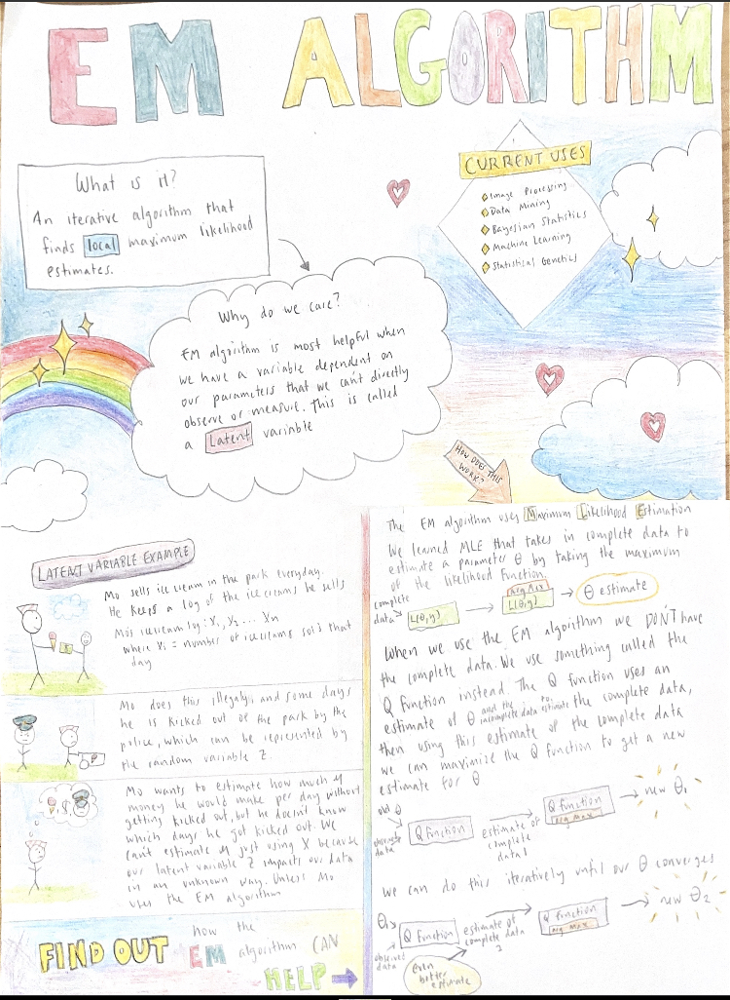

--- 
title: "EM Algorithm"
author: "Wenxuan Zhu, Jingyi Guan, Sarah Tannert-Lerner"
date: "Spring 2023, MATH/STAT 455, Macalester College"
site: bookdown::bookdown_site
---

# Welcome!

First, we would like to give a big thank you to our professor [Kelsey Grinde](https://kegrinde.github.io/) for bringing this amazing class. Her support and encouragement were invaluable to our learning experience in the class :)

```{r, echo=FALSE, fig.align='center', out.width='100%', fig.cap='Intro to EM, made by Sarah'}

```


